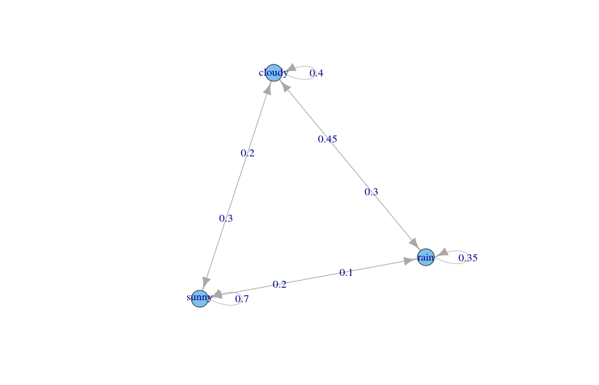

# markovchain

markovchain is an R package for easy handling  of discrete time markov chains

## Installation

You can install `markovchain` from `github` using the `devtools` package

```coffee
install.packages('devtools')
require(devtools)
install_github('spedygiorgio/markovchain')
```

## License

markovchain is licensed under the [GPL v2.0 license](LICENSE)


## Example

```coffee
require(markovchain)
require(igraph)
weatherStates <- c("sunny", "cloudy", "rain")
byRow <- TRUE
weatherMatrix <- matrix(data = c(0.70, 0.2, 0.1,
                                 0.3, 0.4, 0.3,
                                 0.2, 0.45, 0.35),
                        byrow = byRow, nrow = 3,
                        dimnames = list(weatherStates, weatherStates))
mcWeather <- new("markovchain", states = weatherStates,
                 byrow = byRow,
                 transitionMatrix = weatherMatrix, 
                 name = "Weather")
initialState <- c(0, 1, 0)
after2Days <- initialState * (mcWeather * mcWeather)
after2Days
	sunny cloudy rain
[1,] 	0.39 0.355 0.255

plot.igraph(mcWeather)
```

