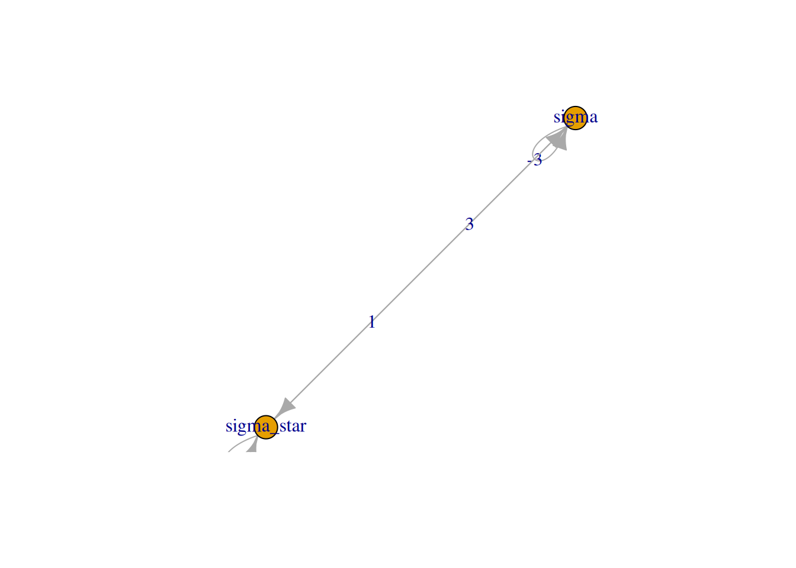
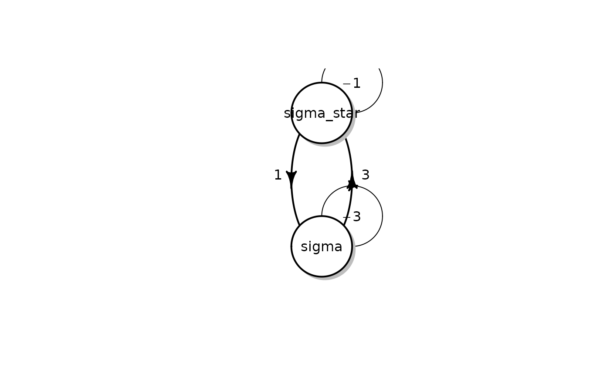

# Google Summer of Code 2017 Additions

## Expected Hitting Time using CTMC

The package provides `ExpectedTime` function to calculate average
hitting time from one state to another. Let the final state be j, then
for every state $i \in I$, where $I$ is the set of all possible states
and holding time $q_{i} > 0$ for every $i \neq j$. Assuming the
conditions to be true, expected hitting time is equal to minimal
non-negative solution vector $p$ to the system of linear equations
([Norris 1998](#ref-NorrisBook)): $$\begin{array}{lc}
{p_{k} = 0} & {k = j} \\
{-\sum\limits_{l \in I}q_{kl}p_{k} = 1} & {k \neq j}
\end{array}$$

For example, consider the continuous time markovchain which is as
follows:

``` r
states <- c("a","b","c","d")
byRow <- TRUE
gen <- matrix(data = c(-1, 1/2, 1/2, 0, 1/4, -1/2, 0, 1/4, 1/6, 0, -1/3, 1/6, 0, 0, 0, 0),
              nrow = 4, byrow = byRow, dimnames = list(states,states))
ctmc <- new("ctmc",states = states, byrow = byRow, generator = gen, name = "testctmc")
```

The generator matrix of the ctmc is: \[ M = ( $$\begin{matrix}
{-1} & {1/2} & {1/2} & 0 \\
{1/4} & {-1/2} & {1/4} & {1/6} \\
{1/6} & 0 & {-1/3} & {1/6} \\
0 & 0 & 0 & 0
\end{matrix}$$

) \]

Now if we have to calculate expected hitting time the process will take
to hit state $d$ if we start from $a$, we apply the `ExpectedTime`
function. `ExpectedTime` takes four inputs namely a `ctmc` class object,
initial state $i$, the final state $j$ that we have to calculate
expected hitting time and a logical parameter whether to use RCpp
implementation. By default, the function uses RCpp as it is faster and
takes lesser time.

``` r
ExpectedTime(ctmc,1,4)
#> [1] 7
```

We find that the expected hitting time for process to be hit state $d$
is 7 units in this case.

## Calculating Probability at time T using ctmc

The package provides a function `probabilityatT` to calculate
probability of every state according to given `ctmc` object. The
Kolmogorov’s backward equation gives us a relation between transition
matrix at any time t with the generator matrix ([Dobrow
2016](#ref-dobrow2016introduction)):

$$P^{\prime}(t) = QP(t)$$

Here we use the solution of this differential equation
$P(t) = P(0)e^{tQ}$ for $t \geq 0$ and $P(0) = I$. In this equation,
$P(t)$ is the transition function at time t. The value
$P(t)\lbrack i\rbrack\lbrack j\rbrack$ at time $P(t)$ describes the
conditional probability of the state at time $t$ to be equal to j if it
was equal to i at time $t = 0$.

It takes care of the case when `ctmc` object has a generator represented
by columns.

If initial state is not provided, the function returns the whole
transition matrix $P(t)$.

Also to mention is that the function is also implemented using RCpp and
can be used to lessen the time of computation. It is used by default.

Next, We consider both examples where initial state is given and case
where initial state is not given.

In the first case, the function takes two inputs, first of them is an
object of the S4 class ‘ctmc’ and second is the final time $t$.

``` r
probabilityatT(ctmc,1)
#>            a          b         c          d
#> a 0.41546882 0.24714119 0.2703605 0.06702946
#> b 0.12357060 0.63939068 0.0348290 0.20220972
#> c 0.09012017 0.02321933 0.7411205 0.14553997
#> d 0.00000000 0.00000000 0.0000000 1.00000000
```

Here we get an output in the form of a transition matrix.

If we take the second case i.e. considering some initial input:

``` r
probabilityatT(ctmc,1,1)
#> [1] 0.41546882 0.24714119 0.27036052 0.06702946
```

In this case we get the probabilities corresponding to every state. this
also includes probability that the process hits the same state $a$ after
time $t = 1$.

## Plotting generator matrix of continuous-time markovchains

The package provides a `plot` function for plotting a generator matrix
$Q$ in the form of a directed graph where every possible state is
assigned a node. Edges connecting these nodes are weighted. Weight of
the edge going from a state $i$ to state $j$ is equal to the value
$Q_{ij}$. This gives a picture of the generator matrix.

For example, we build a ctmc-class object to plot it.

``` r
energyStates <- c("sigma", "sigma_star")
byRow <- TRUE
gen <- matrix(data = c(-3, 3,
                       1, -1), nrow = 2,
              byrow = byRow, dimnames = list(energyStates, energyStates))
molecularCTMC <- new("ctmc", states = energyStates,
                 byrow = byRow, generator = gen,
                 name = "Molecular Transition Model")
```

Now if we plot this function we get the following graph:

``` r
plot(molecularCTMC)
#> Warning: Non-positive edge weight found, ignoring all weights during graph
#> layout.
```



The figure shown is built using the `igraph` package. The package also
provides options of plotting graph using `diagram` and `DiagrammeR`
packages. Plot using these packages can be built using these commands:

``` r
if(requireNamespace(package='ctmcd', quietly = TRUE)) {
  plot(molecularCTMC,package = "diagram")
} else {
  print("diagram package unavailable")
}
```



Similarly, one can easily replace `diagram` package with `DiagrammeR`.

## Imprecise Continuous-Time Markov chains

Continuous-time Markov chains are mathematical models that are used to
describe the state-evolution of dynamical systems under stochastic
uncertainty. However, building models using continuous time markovchains
take in consideration a number of assumptions which may not be realistic
for the domain of application; in particular; the ability to provide
exact numerical parameter assessments, and the applicability of
time-homogeneity and the eponymous Markov property. Hence we take ICTMC
into consideration.

More technically, an ICTMC is a set of “precise” continuous-time
finite-state stochastic processes, and rather than computing expected
values of functions, we seek to compute lower expectations, which are
tight lower bounds on the expectations that correspond to such a set of
“precise” models.

### Types of ICTMCs

For any non-empty bounded set of rate matrices $L$, and any non-empty
set $M$ of probability mass functions on $X$, we define the following
three sets of stochastic processes that are jointly consistent with $L$
and $M$:

- $P_{L,M}^{W}$ is the consistent set of all well-behaved stochastic
  processes;
- $P_{L,M}^{WM}$ is the consistent set of all well-behaved Markov
  chains;
- $P_{L,M}^{WHM}$ is the consistent set of all well-behaved homogeneous
  Markov chains ([Thomas Krak 2017](#ref-ictmcpaper)).

From a practical point of view, after having specified a (precise)
stochastic process, one is typically interested in the expected value of
some function of interest, or the probability of some event. Similarly,
in this work, our main objects of consideration will be the lower
probabilities that correspond to the ICTMCs.

### Lower Transition Rate Operators for ICTMCs

A map $Q_{l}$ from $L(X)$ to $L(X)$ is called a lower transition rate
operator if, for all $f,g \in L(X)$, all $\lambda \in R_{\geq 0}$, all
$\mu \in L(X)$, and all $x \in X$([Thomas Krak 2017](#ref-ictmcpaper)):

1.  $\lbrack Q_{l}m\rbrack(x) = 0$
2.  $\lbrack Q_{l}I\rbrack(x) \geq 0\forall y \in X$ such that
    $x \neq y$
3.  $\lbrack Q_{l}(f + g)\rbrack(x) \geq \lbrack Q_{l}f\rbrack(x) + \lbrack Q_{l}g\rbrack(x)$
4.  $\lbrack Q_{l}(lf)\rbrack(x) = \lambda Q_{l}f\lbrack(x)\rbrack$

### Lower Transition Operators

A map $T_{l}$ from $L(X)$ to $L(X)$ is called a lower transition
operator if, for all $f,g \in L(X)$, all $\lambda \in R_{\geq 0}$, all
$\mu \in L(X)$, and all $x \in X$([Thomas Krak 2017](#ref-ictmcpaper)):

1.  $\lbrack T_{l}f\rbrack(x) \geq min(f(y):y \in L)$
2.  $\lbrack T_{l}(f + g)\rbrack(x) \geq \lbrack T_{l}f\rbrack(x) + \lbrack T_{l}g\rbrack(x)$
3.  $\lbrack T_{l}(\lambda f)\rbrack(x) = l\lbrack T_{l}f\rbrack(x)$

### ImpreciseProbabilityatT function

Now I would like to come onto the practical purpose of using ICTMC
classes. ICTMC classes in these package are defined to represent a
generator that is defined in such a way that every row of the generator
corresponding to every state in the process is governed by a separate
variable. As defined earlier, an imprecise continuous time markovchain
is a set of many precise CTMCs. Hence this representation of set of
precise CTMCs can be used to calulate transition probability at some
time in future. This can be seen as an analogy with `probabilityatT`
function. It is used to calculate the transition function at some later
time t using generatoe matrix.

For every generator matrix, we have a corresponding transition function.
Similarly, for every Lower Transition rate operator of an ICTMC, there
is a corresponding lower transition operator denoted by $L_{t}^{s}$.
Here $t$ is the initial time and $s$ is the final time.

Now we mention a proposition ([Thomas Krak 2017](#ref-ictmcpaper)) which
states that:

Let $Q_{l}$ be a lower transition rate operator, choose any time $t$ and
$s$ both greater than 0 such that $t \leq s$, and let $L_{t}^{s}$ be the
lower transition operator corresponding to $Q_{l}$. Then for any
$f \in L(X)$ and $\epsilon \in R_{> 0}$, if we choose any $n \in N$ such
that:

\[ n max((s-t)\*\|\|Q\|\|,(s-t)^({2}\|\|Q\|\|){2}\|\|f\|\|\_v) \]

with $||f||_{v}$ := max $f$ - min $f$, we are guaranteed that ([Thomas
Krak 2017](#ref-ictmcpaper))

\[ \|\|L\_{t}^{s} - *{i=1}^{n}(I + Q*{l}) \|\| \]

with $\Delta:=\frac{s - t}{n}$

Simple put this equation tells us that, using $Q_{l}g$ for all
$g \in L(X)$ then we can also approximate the quantity $L_{t}^{s}$ to
arbitrary precision, for any given $f \in L(X)$.

To explain this approximate calculation, I would take a detailed example
of a process containing two states healthy and sick, hence
$X = (healthy,sick)$. If we represent in form of an ICTMC, we get:

\[ Q = ( $$\begin{matrix}
{-a} & a \\
b & {-b}
\end{matrix}$$

) \]

for some $a,b \in R_{\geq 0}$.

The parameter $a$ here is the rate at which a healthy person becomes
sick. Technically, this means that if a person is healthy at time $t$,
the probability that he or she will be sick at time $t + \Delta$, for
small $\Delta$, is very close to $\Delta a$. More intuitively, if we
take the time unit to be one week, it means that he or she will, on
average, become sick after $\frac{1}{a}$ weeks. The parameter $b$ is the
rate at which a sick person becomes healthy again, and has a similar
interpretation.

Now to completely represent the ICTMC we take an example and write the
generator as:

\[ Q = ( $$\begin{matrix}
{-a} & a \\
b & {-b}
\end{matrix}$$

) : a ,b \]

Now suppose we know the initial state of the patient to be sick, hence
this is represented in the form of a function by:

\[ I\_{s} = ( $$\begin{matrix}
0 \\
1
\end{matrix}$$

) \]

We observe that the $||I_{s}|| = 1$.

Now to use the proposition mentioned above, we use the definition to
calculate the lower transition operator $Q_{l}$ Next we calculate the
norm of the lower transition rate operator and use it in the
proposition. Also we take value of $\epsilon$ to be 0.001.

Using the proposition we can come up to an algorithm for calculating the
probability at any time $s$ given state at initial time $t$ and a ICTMC
generator ([Thomas Krak 2017](#ref-ictmcpaper)).

The algorithm is as follows:

**Input**: A lower transition rate operator $Q$, two time points $t,s$
such that $t \leq s$, a function $f \in L(X)$ and a maximum numerical
error $\epsilon \in R_{> 0}$.

**Algorithm**:

1.  $n = max((s - t)||Q||,\frac{1}{2\epsilon}(s - t)^{2}||Q||^{2}||f||_{v})$
2.  $\Delta = \frac{s - t}{n}$
3.  $g_{0} = I_{s}$
4.  for $i \in (1,.....,n)$ do
    $g_{i} = g_{i - 1} + \Delta Q_{l}g_{i - 1}$
5.  end for
6.  return $g_{n}$

**Output**:

The conditional probability vector after time $t$ with error $\epsilon$.
Hence, after applying the algorithm on above example we get the
following result:

$g_{n} = 0.0083$ if final state is $healthy$ and $g_{n} = 0.141$ if
final state is $sick$. The probability calculated is with an error equal
to $\epsilon$ i.e. $0.001$.

Now we run the algorithm on the example through R code.

``` r
states <- c("n","y")
Q <- matrix(c(-1,1,1,-1),nrow = 2,byrow = TRUE,dimnames = list(states,states))
range <- matrix(c(1/52,3/52,1/2,2),nrow = 2,byrow = 2)
name <- "testictmc"
ictmc <- new("ictmc",states = states,Q = Q,range = range,name = name)
impreciseProbabilityatT(ictmc,2,0,1,10^-3,TRUE)
#> [1] 0.008259774 0.140983476
```

The probabilities we get are with an error of $10^{-3}$

## Continuous time markovchain generator using frequency Matrix

The package provides `freq2Generator` function. It takes in a matrix
representing relative frequency values along with time taken to provide
a continuous time markovchain generator matrix. Here, frequency matrix
is a 2-D matrix of dimensions equal to relative number of possible
states describing the number of transitions from a state $i$ to state
$j$ in time $t$, which is another parameter to be provided to the
function. The function also allows to chose among three methods for
calculation of the generator matrix ([Alexander Kreinin
2001](#ref-freqArticle)). It requires the `ctmcd` package.

Three methods are as follows:

1.  Quasi Optimization - “QO”
2.  Diagonal Adjustment - “DA”
3.  Weighted Adjustment - “WA”

See reference for details about the methods.

Here is an example matrix on which `freq2Generator` function is run:

``` r
if(requireNamespace(package='ctmcd', quietly = TRUE)) {
  sample <- matrix(c(150,2,1,1,1,200,2,1,2,1,175,1,1,1,150),nrow = 4,byrow = TRUE)
  sample_rel = rbind((sample/rowSums(sample))[1:dim(sample)[1]-1,],c(rep(0,dim(sample)[1]-1),1))
  freq2Generator(sample_rel,1)
} else {
  print('ctmcd unavailable')
}
#> Warning in matrix(c(150, 2, 1, 1, 1, 200, 2, 1, 2, 1, 175, 1, 1, 1, 150), :
#> data length [15] is not a sub-multiple or multiple of the number of rows [4]
#>              [,1]        [,2]         [,3] [,4]
#> [1,] -0.024212164  0.01544797  0.008764198    0
#> [2,]  0.006594821 -0.01822834  0.011633520    0
#> [3,]  0.013302567  0.00749703 -0.020799597    0
#> [4,]  0.000000000  0.00000000  0.000000000    0
```

## Committor of a markovchain

Consider set of states A,B comprising of states from a markovchain with
transition matrix P. The committor vector of a markovchain with respect
to sets A and B gives the probability that the process will hit a state
from set A before any state from set B.

Committor vector u can be calculated by solving the following system of
linear equations ([Mathematics Stack Exchange
2015](#ref-committorlink)):

$$\begin{array}{l}
{Lu(x) = 0,x \notin A \cup B} \\
{u(x) = 1,x \in A} \\
{u(x) = 0,x \in B}
\end{array}$$

Now we apply the method to an example:

``` r
transMatr <- matrix(c(0,0,0,1,0.5,0.5,0,0,0,0,0.5,0,0,0,0,0,0.2,0.4,0,0,0,0.8,0.6,0,0.5),nrow = 5)
object <- new("markovchain", states=c("a","b","c","d","e"),transitionMatrix=transMatr, name="simpleMc")
committorAB(object,c(5),c(3))
```

Here we get probability that the process will hit state “e” before state
“c” given different initial states.

## First Passage probability for set of states

Currently computation of the first passage time for individual states
has been implemented in the package. `firstPassageMultiple` function
provides a method to get first passage probability for given provided
set of states.

Consider this example markovchain object:

``` r
statesNames <- c("a", "b", "c")
testmarkov <- new("markovchain", states = statesNames, transitionMatrix =
matrix(c(0.2, 0.5, 0.3,
0.5, 0.1, 0.4,
0.1, 0.8, 0.1), nrow = 3, byrow = TRUE,
dimnames = list(statesNames, statesNames)
))
```

Now we apply `firstPassageMultiple` function to calculate first passage
probabilities for set of states \$"b", "c"\$ when initial state is
\$"a"\$.

``` r
firstPassageMultiple(testmarkov,"a",c("b","c"),4)
#>      set
#> 1 0.8000
#> 2 0.6000
#> 3 0.2540
#> 4 0.1394
```

This shows us the probability that the process will hit any of the state
from the set after n number of steps for instance, as shown, the
probability of the process to hit any of the states among \$"b", "c"\$
after $2$ steps is $0.6000$.

## Joint PDF of number of visits to the various states of a markovchain

The package provides a function `noofVisitsDist` that returns the PDF of
the number of visits to the various states of the discrete time
markovchain during the first N steps, given initial state of the
process.

We will take an example to see how to use the function on a
`markovchain-class` object:

``` r
transMatr<-matrix(c(0.4,0.6,.3,.7),nrow=2,byrow=TRUE)
simpleMc<-new("markovchain", states=c("a","b"),
              transitionMatrix=transMatr,
              name="simpleMc")
noofVisitsDist(simpleMc,5,"a")
#>        a        b 
#> 0.348148 0.651852
```

The output clearly shows the probabilities related to various states of
the process.

## Expected Rewards for a markovchain

The package provides a function `expectedRewards` that returns a vector
of expected rewards for different initial states. The user provides
reward values, a vector $r$ of size equal to number of states having a
value corresponding to every state. Given a transition matrix
$\lbrack P\rbrack$, we get the vector of expected rewards $v$ after $n$
transitions according to the equation as follows ([Gallager
2013](#ref-GallagerBook)):

$$v\lbrack n\rbrack = r + \lbrack P\rbrack*v\lbrack n - 1\rbrack$$

Applying this equation on a markovchain-class object

``` r
transMatr<-matrix(c(0.99,0.01,0.01,0.99),nrow=2,byrow=TRUE)
simpleMc<-new("markovchain", states=c("a","b"),
             transitionMatrix=transMatr)
expectedRewards(simpleMc,1,c(0,1))
#> [1] 0.01 1.99
```

### Expected Rewards for a set of states in a markovchain process

The package provides a function `expectedRewardsBeforeHittingA` that
returns the value of expected first passage rewards $E$ given rewards
corresponding to every state, an initial state. This means the function
returns expected reward for given initial state $s_{0}$, number of
transitions $n$ and for a set of states $A$ with a constraint such that
the process does not hit any of the states that belong to state $A$. $S$
is the set of all possible states.

The function uses an equation which is as follows:

$$E = \sum\limits_{i = 1}^{n}{1_{s_{0}}P_{S - A}^{i}R_{S - A}}$$

here $1_{s_{0}} = \lbrack 0,0,...0,1,0,...,0,0,0\rbrack$, 1 being on
$s_{0}$ position and $R_{S - A}$ being the rewards vector for $S - A$
state.

## Checking Irreducibly of a CTMC

The package provides `is.CTMCirreducible` that returns a Boolean value
stating whether the ctmc object is irreducible.

We know that a continuous time markovchain is irreducible if and only if
its embedded chain is irreducible ([Sigman 2009](#ref-Sigman)).

We demonstrate an example running the function:

``` r
energyStates <- c("sigma", "sigma_star")
byRow <- TRUE
gen <- matrix(data = c(-3, 3,
                      1, -1), nrow = 2,
              byrow = byRow, dimnames = list(energyStates, energyStates))
molecularCTMC <- new("ctmc", states = energyStates,
                 byrow = byRow, generator = gen,
                 name = "Molecular Transition Model")
is.CTMCirreducible(molecularCTMC)
#> [1] TRUE
```

## Simulation of Higher Order Multivariate Markovchains

The package provides `predictHommc` function. This function provides a
simulation system for higher order multivariate markovchains. The
function assumes that the state probability distribution of the jth
sequence at time r+1 depends on the state probability distribution of
all the sequences at n previous moments of time i.e. $t = r$ to
$t = r - n + 1$. Hence the proposed model takes the form mathematically
as ([Ching et al. 2008](#ref-ching2008higher)):

$$X_{r + 1}^{j} = \sum\limits_{k = 1}^{s}\sum\limits_{h = 1}^{n}{\lambda_{jk}^{(h)}P_{h}^{(jk)}X_{r - h + 1}^{(k)}},\ \ j = 1,2,....s,\ r = n - 1,n,...$$

with initials
$X_{0}^{(k)},X_{1}^{(k)},......,X_{n - 1}^{(k)}\ (k = 1,2,...s)$. Here,

$$\lambda_{jk}^{(k)},\ 1 \leq j,k \leq s,\ 1 \leq h \leq n\ \text{and}\ \sum\limits_{k = 1}^{s}\sum\limits_{h = 1}^{n}{\lambda_{jk}^{(h)} = 1},\ j = 1,2,....s.$$

Now we run an example on sample hommc object for simulating next 3 steps
using `predictHommc` function. The function provides a choice of
entering initial states according to the hommc object. In case the user
does not enter initial states, the function takes all initial states to
be the first state from the set of states.

``` r
if (requireNamespace("Rsolnp", quietly = TRUE)) {
statesName <- c("a", "b")
P <- array(0, dim = c(2, 2, 4), dimnames = list(statesName, statesName))
P[,,1] <- matrix(c(0, 1, 1/3, 2/3), byrow = FALSE, nrow = 2)
P[,,2] <- matrix(c(1/4, 3/4, 0, 1), byrow = FALSE, nrow = 2)
P[,,3] <- matrix(c(1, 0, 1/3, 2/3), byrow = FALSE, nrow = 2)
P[,,4] <- matrix(c(3/4, 1/4, 0, 1), byrow = FALSE, nrow = 2)
Lambda <- c(0.8, 0.2, 0.3, 0.7)
ob <- new("hommc", order = 1, states = statesName, P = P,
         Lambda = Lambda, byrow = FALSE, name = "FOMMC")
predictHommc(ob,3)
} else {
  print("Rsolnp unavailable")
}
#>      [,1] [,2] [,3]
#> [1,] "a"  "b"  "a" 
#> [2,] "a"  "a"  "a"
```

## Check Time Reversibility of Continuous-time markovchains

A Continuous-time markovchain with generator $Q$ and stationary
distribution $\pi$ is said to be time reversible if ([Dobrow
2016](#ref-dobrow2016introduction)):

$$\pi_{i}q_{ij} = \pi_{j}q_{ji}$$

Intuitively, a continuous-time Markov chain is time reversible if the
process in forward time is indistinguishable from the process in
reversed time. A consequence is that for all states i and j, the
long-term forward transition rate from i to j is equal to the long-term
backward rate from j to i.

The package provides `is.TimeReversible` function to check if a `ctmc`
object is time-reversible.

We follow with an example run on a `ctmc` object.

``` r
energyStates <- c("sigma", "sigma_star")
byRow <- TRUE
gen <- matrix(data = c(-3, 3,
                        1, -1), nrow = 2,
              byrow = byRow, dimnames = list(energyStates, energyStates))
molecularCTMC <- new("ctmc", states = energyStates,
                    byrow = byRow, generator = gen,
                    name = "Molecular Transition Model")
is.TimeReversible(molecularCTMC)
#> [1] TRUE
```

### References

Alexander Kreinin, Marina Sidelnikova. 2001. “Regularization Algorithms
for Transition Matrices.” *Algo Research Quarterly* 4 (1/2): 23–40.

Ching, Wai-Ki, Michael K Ng, and Eric S Fung. 2008. “Higher-Order
Multivariate Markov Chains and Their Applications.” *Linear Algebra and
Its Applications* 428 (2): 492–507.

Dobrow, Robert P. 2016. *Introduction to Stochastic Processes with r*.
John Wiley & Sons.

Gallager, Robert G. 2013. *Stochastic Processes: Theory for
Applications*. Cambridge University Press.

Mathematics Stack Exchange. 2015. *Probability That a Chain Will Enter
State 5 Before It Enters State 3*.
<https://math.stackexchange.com/questions/1450399/probability-that-a-chain-will-enter-state-5-before-it-enters-state-3?newreg=82f90b66b949495a91661caad24db915>.

Norris, J. R. 1998. *Markovchains*. Cambridge University Press.

Sigman, Karl. 2009. *Continuous Time Markovchains*. Columbia University.

Thomas Krak, Arno Siebes, Jasper De Bock. 2017. “Imprecise Continuous
Time Markov Chains.” *International Journal of Approximate Reasoning*
88: 452–528.
